# SQL DEVELOPER KURZUSHOZ TELEPÍTÉSI SEGÉDLET 1 CORE SERVER + 1 CLIENT BEÁLLÍTÁSÁVAL OTTHONI FIZIKAI KÖRNYEZETBEN VIRTULIZÁCIÓ HASZNÁLATÁVAL EMULÁLT ACTIVE DIRECTORY STRUKTÚRÁBAN

> **HOZZÁVALÓK**

 * 2 db számítógép (a példában egy laptop 8G RAM-al, egy desktop 4G RAM-al)
 * valamilyen virtualizációs rendszer ismerete, használata windows gazdarendszerekre inkább vmware, linuxra inkább kvm.
 * A kvm-servernek szánt gépen nem kell bejelentkezni. Minimálisan szükséges erőforrási igénye: max 300 Mbyte RAM, 1 processzor "szál". (`cat /proc/cpuinfo | grep -c proc`). Ha a rendszeren a vbetool nem működik a képernyő lekapcsolására parancssori felületen az sddm gui bejelentkező használható képernyő lekapcsoláshoz (xorg dpms serverflags). Amennyiben működik pl. systemctl stop sddm-el lekapcsolható egy sddm gui ablakkezelő.
 * ssh és sshfs kapcsolat a terminálnak szánt rendszerről a servernek szánt rendszerre. ssh tunnel kell (!!)
 * telepített fuse,ntfs-3g csatolási segédeszközök

> **KIINDULÁSI TOPOLÓGIA**

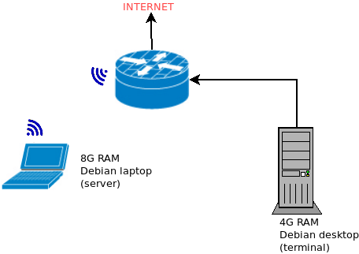

> **1. lépés: VDE Telepítése laptop 8G serverre, ha VMWARE-t használsz ez elhagyható**

`apt install vde2`

 * Telepítés után be kell állítani. Telepítéskor létrejön egy vde2-net nevű csoport egy vde2-net nevű felhasználónévvel. 
 * A `/etc/group` fileba a vde2-net csoportba be kell tenni azt a felhasználót akinek a nevében majd a kvm virtuális gép fut. jelen példában (lagoth).Szükséges lehet a kvm csoportba is betenni.
 * A virtuális switch paramétereit be kell állítani (a MAC cím tetszés szerinti, csak eltérő legyen a meglevő eszközöktől). Debian rendszerekben a `/etc/network/interfaces`-ben lehet beállítani a következő sorok beírásával. Az emulációhoz a tun/tap alrendszert használja amit a networkmanager (nmcli)-hez hasonló eszközök általában nem ismernek fel, ezért célszerű kézzel beírni. A módosítás után a hálózati alrendszert / vagy a gazdagépet újra kell indítani. 

`auto tap0` / ha nem akarod elindítani bootoláskor ezt ki kell kommentelni. De akkor a tap0 eszközt manuálisan kell elindítani /

`iface tap0 inet static`

`    hwaddress f6:2b:23:50:7a:3c`

`    address 192.168.2.254`

`    netmask 255.255.255.0`

`    pre-up /usr/bin/vde_switch --tap tap0 --sock /var/run/vde.ctl \`

`                        --daemon --group vde2-net --mod 775 \`

`                        --mgmt /var/run/vde.mgmt --mgmtmode 770 \`

`                        --pidfile /var/run/vde_switch.pid`

`    post-down kill -s KILL $(cat /var/run/vde_switch.pid);rm /var/run/vde_switch.pid;rm /var/run/vde.ctl/ctl;rm /var/run/vde.mgmt`

Ha mindez megtörtént az `ip a` parancssal már látni kell a tap0 virtuális switchet.

 * Ezután be kell állítani, hogy a tap0 routerként viselkedjen átengedje a forgalmat, és NAT-olja a fizikai hálózat felé, hogy a tap0 mögött álló eszközök elérjék az internetet.

Előszőr is a gazdagépen be kell állítani a csomagirányítást hogy a hálózati interfacek egymásnak tudjanak csomagot küldeni. Ez lehet pl. a `/etc/sysctl.conf`-ban de a módosítások csak újraindítás után lépnek életbe. A következő sort módosítani kell 0-ról:

`net.ipv4.ip_forward=1`

Célszerű beszúrni a következő sort is:

`net.ipv4.conf.lo.forwarding=0`

Az első engedi a forgalmat a hálózati interfacek között a második kivételként a loopback-et felveszi, hogy azon ne történjen csomagátirányítás.

majd az iptables rendszerben be kell állítani a NAT funkciót az internet eléréséhez (internetkapcsolat wlan0 eszközön):

`iptables -t nat -o wlan0 -s 192.168.2.0/24 -j MASQUERADE`

Amennyiben használsz korlátozó tűzfalszabályokat az iptables FORWARD táblát is be kell állítani a 2 interféce között.

Így az alábbi topológia már kialakítható:

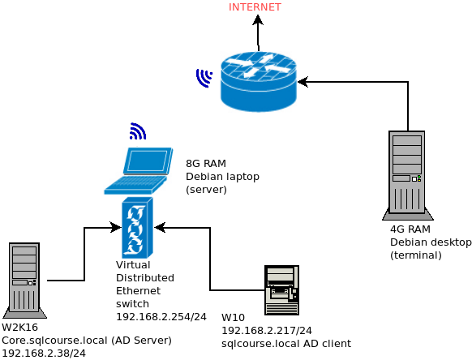

> **2. lépés: virtuális Windows 2016 Server létrehozása**

 * `qemu-img create w2016.raw 34G` parancssal létre kell hozni a merevlemezt amire a win2016 server kerül.

 * Virtuális gép elindítása célszerű bash szkriptből:

`export QEMU_AUDIO_DRV="none"`

`kvm -daemonize -monitor telnet:127.0.0.1:33011,server,nowait,ipv4 -name windows2016 -smp 4 -rtc base=localtime -spice port=6090,addr=127.0.0.1,disable-ticketing,image-compression=off -vga qxl -k hu -m 4096 -drive file=w2016.raw,format=raw,if=ide -cdrom w2k16.iso -device virtio-serial-pci,id=virtio-serial0,max_ports=16,bus=pci.0,addr=0x5 -chardev spicevmc,name=vdagent,id=vdagent -device virtserialport,nr=1,bus=virtio-serial0.0,chardev=vdagent,name=com.redhat.spice.0 -soundhw hda -boot d -net nic,macaddr=cb:31:0f:29:38:7f -net vde`

A qemu telnet port localhost:33011-ra, a képernyő a spice protokollon localhost:6090-re kerül a másik fizikai gépről ssh tunnellel problémamentesen elérhetőek. A -cdrom csatolja be a telepítőcd-t, illetve előkészíti a spice agent használatát, hangra server esetében nincs szükség.A MAC cím szabadon választható, csak olyan legyen amit másik eszköz még nem használ. 4G RAM-ot használ a virtuális gép.
Egy 8 total thread-es (`core*thread`) processzor esetében (`cat /proc/cpuinfo | grep -c proc`) 4-et adhatsz a servernek, egy marad a gazdarendszernek és 3 jut majd az AD kliensnek. 8G RAM esetén 4G mehet a servernek, 3,5G mehet a kliensnek a hostnak elég 500 MB.

Telepítéskor a Standard Evaluation teszi fel a Win2k16 core servert. A terminálos gépről ssh tunnel-en keresztül elérhető a 33011-es port `telnet localhost 33011` parancssal amennyiben a terminál szintén a 33011-et használja a tunnelhez.

Így tudod beküldeni a ctrl-alt-del kombinációt a bejelentkezéshez:

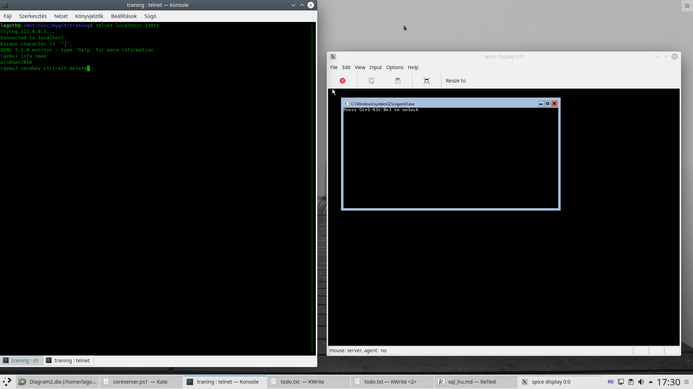

Ezután már be tudsz jelentkezni az admin. jelszóval:

Majd az `sconfig` parancssal célszerű átírni a gépnevet pl. CORE-ra. Ezután restart.

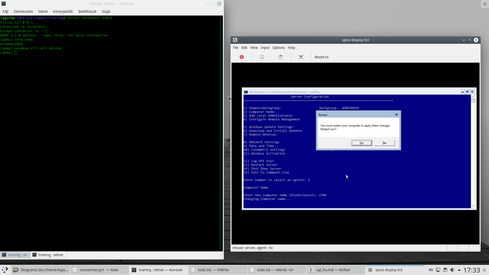

Majd ismét `sconfig` és beállítani az időt, **időzónát** a 9-es és a hálózatot a 8-as menüponttal:

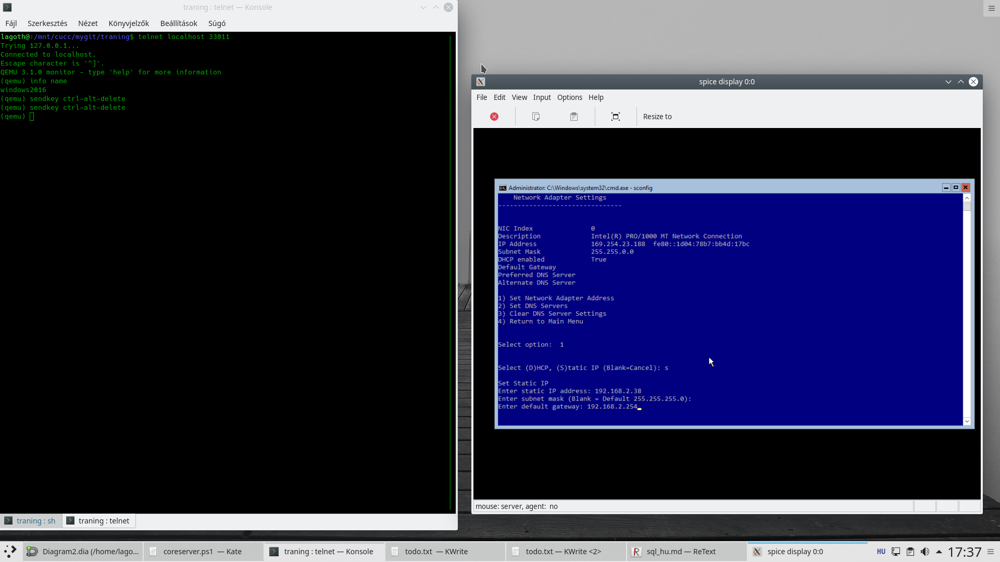

Így már lesz internet:

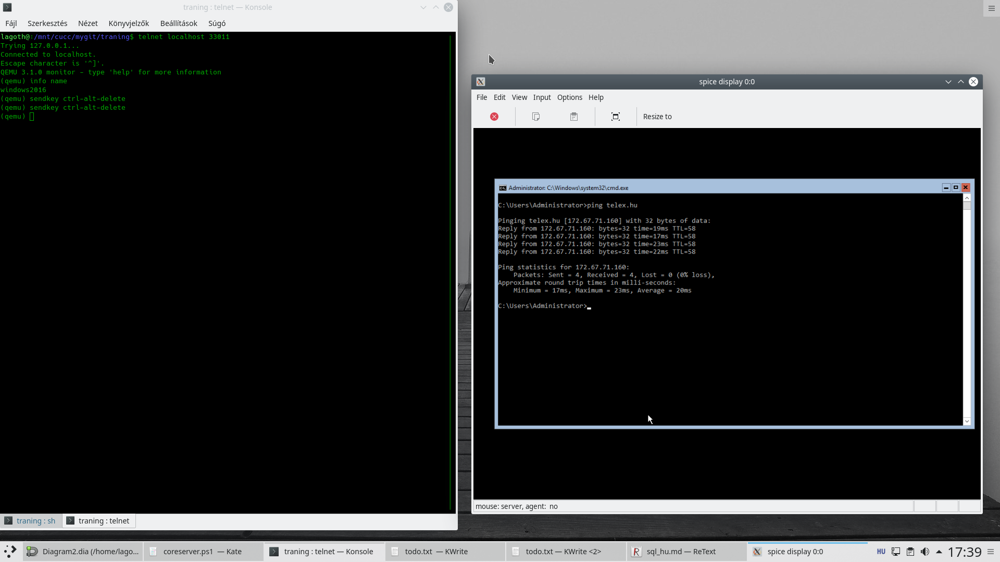

Az AD telepítéshez érdemes létrehozni egy új felhasználót: (példában archmage)

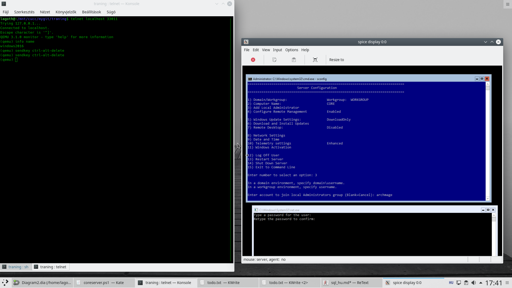

Majd állítsd le a servert (shutdown) 14-es menüpont.

Jelentkezz át a gazdagépen root jogba és fdisk-el nézd meg a w2016.raw (windows 2016 virtuális merevlemez) partíciós tábláját:

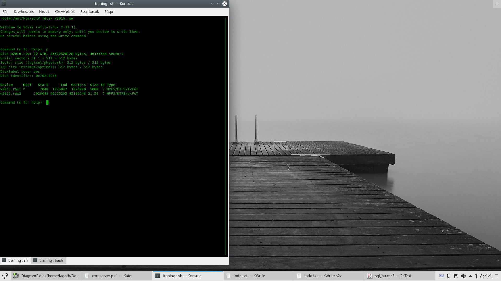

Itt ki kell számítani az offset értéket.

Ez `szektorszám*szektorkezdet`.

A 21,5G méretű partíciónál ez `512*1026048=525336576`

A virtuális merevlemezt így a serveres gazdagépen már be lehet csatolni pl.

`mount -o loop,offset=525336576 w2016.raw /srv`

parancssal. Így a terminálos asztali gépről sshfs-en keresztül fel lehet másolni a laptopon levő leállított w2016 server merevlemezére telepítendő fájlokat.

pl. létrehozás után a mytools könyvtárba.

Ezután csatold le a /srv-ről a merevlemezt és indítsd el újra a w2016 servert és jelentkezz be az új admin felhasználóval (archmage). A C:\mytools mappában benne lesznek a segédeszközök.

Előszőr a spice-guest-tools-t kell feltelepíteni. A tool [itt](https://www.spice-space.org/download/windows/spice-guest-tools/spice-guest-tools-latest.exe) elérhető.

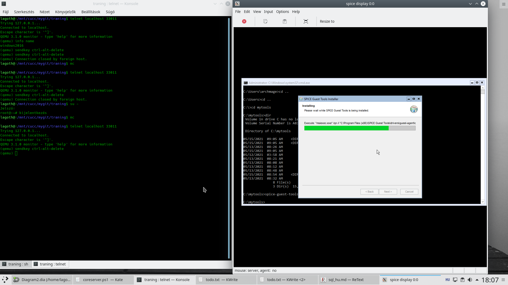

Ezután spice-on keresztül már működik a vágólap a terminálos fizikai gép a laptop(server) en futó virtuális windows 2016 server között. A spice kliensnél a (**mouse:client,agent=yes**) jelzi hogy működik a spice-tools. Ez vmware-tools-hoz hasonló eszköz csak qemu/kvm környezetben.

Telepítsd fel az admincentert. A telepítési fájl [itt](https://aka.ms/WACDownload) érhető el közvetlenül. A telepítési automata batch fájl peddig [itt](scripts/admininstall.bat). Semmit nem kérdez.

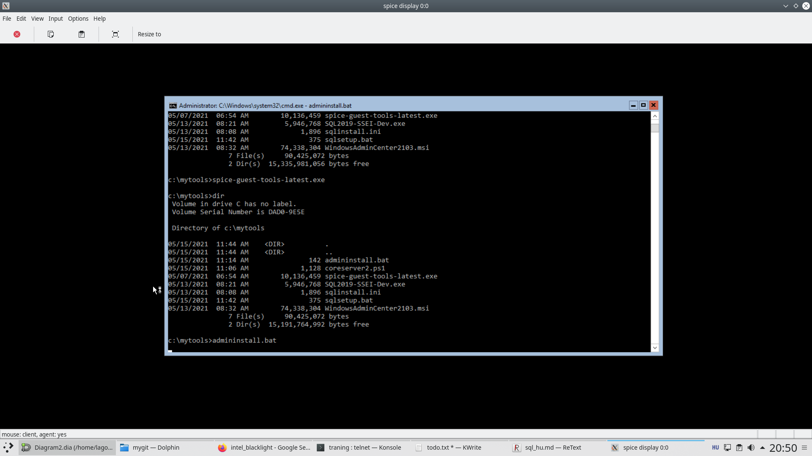

Ezután AD telepítés jön tűzfalbeállításokkal. `powershell` parancssal kell indítani. A példához használt PS1 script [itt](scripts/coreserver2.ps1) elérhető. Vigyázat ! Ez sem kérdez semmit, kérdés nélkül beállít mindent a példa alapján (DC=core.sqlcourse.local) !

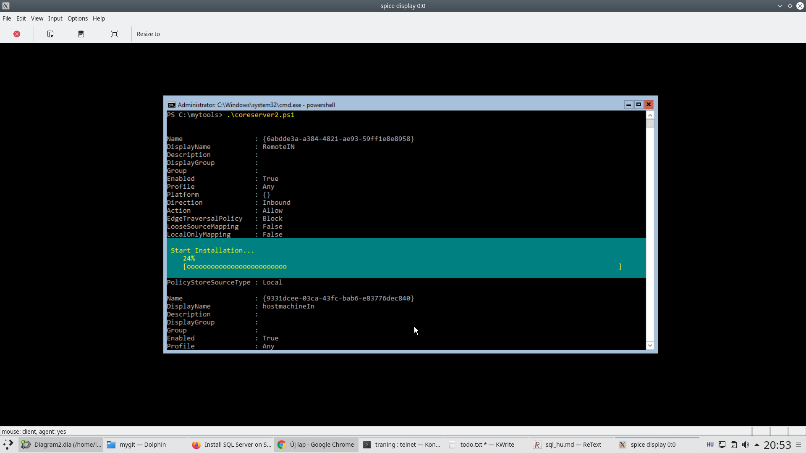

Az AD telepítés után működik az Admin Center a példában elmozgatva a 6571-es porton. eszközkezelő, tűzfal, ill. fájlmozgatáshoz lehet kiválóan használni. Néha lassú...
Ne felejtsd el, hogy a terminal asztali kliensről ssh tunnelt be kell állítani a virtuális gép adott portjára. Ebben a példában `-L 43443:192.168.2.38:6571` -es ssh kliens opcióval.

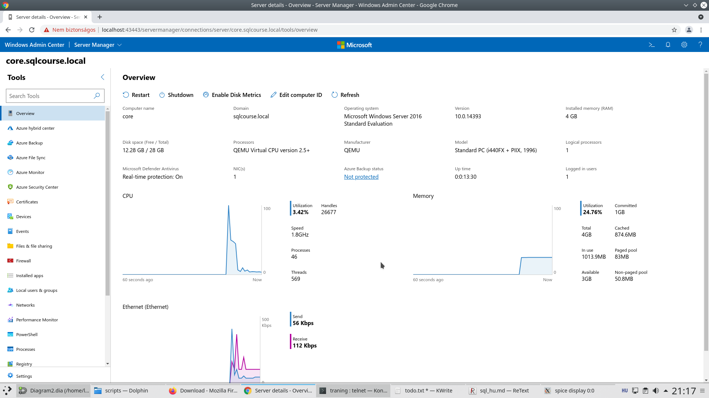

Ha helyhiány lép fel, a virtuális gép leállítása után ki tudod terjeszteni a virtuális rendszermerevlemezt is.

`qemu-img info w2016.raw`

kiírja hogy mennyi a virtuális merevlemez mérete (34G), jelenleg mennyi helyet foglal merevlemezen (26G)

Pl. Így lehet 8G-vel megnövelni: (A RAW formátumot csak lecsatolt nem használt állapotban lehet átméretezni)

`qemu-img resize -f raw w2016.raw +8G`

Ezután :

`qemu-img info w2016.raw`

parancs kimenete:

`image: w2016.raw`

`file format: raw`

`virtual size: 42G (45097156608 bytes)`

`disk size: 26G`

Ez csak a virtuális merevlemez "fizikai" mérete, még a rendszerpartíciót is meg kell növelni (NTFS), pl. admincenter révén.

A korábbi frissítések, összevont patchek eltávolításával is lehet helyet sprórolni:

`Dism.exe /online /Cleanup-Image /StartComponentCleanup /ResetBase`

A parancs forrása [itt](https://docs.microsoft.com/en-us/windows-hardware/manufacture/desktop/clean-up-the-winsxs-folder).

A qemu monitoros telnet parancsok is szkriptelhetőek except segítségével. [Itt](scripts/expectexample.sh) egy mintapélda ami az "info status" parancsot futtatja. De le lehet cserélni pl. drive-backupra :-)

