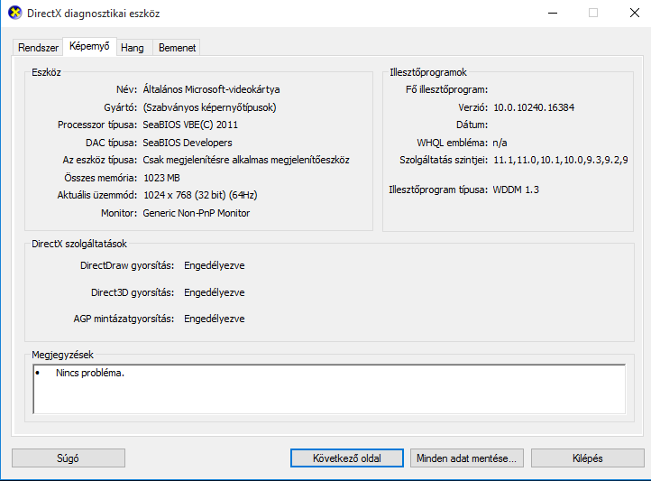

# Linux Hoston 1024x768 felbontásban 3D-vel használható virtualizáció 1db 32bites Windows 10 részére

> **Hozzávalók**

  * vmx / kvm bittel ellátott Processzor 64bites rendszerben
  * 3D kernel modul a grafikus kártyához (pl. nvidia bináris driver)
  * pulseadio hangrendszer a linux hoston
  * Feltelepített kvm,qemu csomagok
  * bash
  * TCP/IP IPv4
  * kvm virtuális gépbe feltelepített 32 bites 10
  * Másodlagos billentyűzet, vagy egyéb beviteli eszköz (ssh kliens is megteszi egy másik gépről, vagy mobiltelefonról)
  * sudo

> **Nem szükséges**

  * libvirt keretrendszer
  * Vt-d (IOMMU technology as Virtualization Technology for Directed I/O) képes processzor

> **Ajánlott**

  * Külön felhasználói kód ami csak virtuális gépek futtatására szolgál

> **Előzetes beállítás**

  * Amennyiben a virtuális gépet külön felhasználóval indítjuk azt be kell állítani. (jelszó nélküli - ! az etc shadow file-ban - min. csoporttagság audio,kvm,input

> **Egyéb Információ**

  * Az egyszerűség kedvéért hálózat nélküli módban fut a virtuális gép. A hálózat beállítása egy külön témakör (VDE).
  * [Utolsó Stabil Virtio Driver CD ISO windows 8+ rendszerhez](https://fedorapeople.org/groups/virt/virtio-win/direct-downloads/latest-virtio/virtio-win.iso)
  * [Teljes QEMU Monitor help](https://qemu-project.gitlab.io/qemu/system/monitor.html)

A 2 soros bash szkript ami indítja a virtuális gépet:

    export QEMU_AUDIO_DRV=pa;
    sudo -u virtmagus kvm -monitor telnet:127.0.0.1:40010,server,nowait,ipv4 -object input-linux,id=kbd1,evdev=/dev/input/by-path/platform-i8042-serio-0-event-kbd,grab_all=on,repeat=on -usb -device usb-mouse -rtc base=localtime -k hu -daemonize -smp 1,maxcpus=2 -cpu host -display none -vga virtio -spice port=6583,addr=127.0.0.1,disable-ticketing,image-compression=off -bios other.bios -acpitable file=other.bin -m 2048 -drive file=w10.raw,format=raw,index=0,if=ide -cdrom cdrom.iso -soundhw ac97 -boot c -net none

> Szkript magyarázata

  * `export QEMU_AUDIO_DRV=pa` : QEMU a pulseadio hangrendszert használja.
  * sudo -u virtmagus : az ezután következő parancsot a virtmagus nevű user nevében futtatja
  * kvm : kvm :-)
  * -monitor telnet:127.0.0.1:40010,server,nowait,ipv4 : telnet típusú server socketet nyit ipv4-en localhoston 40010-es porton virtuális gép spec. vezérléséhez
  * -object input-linux,id=kbd1,evdev=/dev/input/by-path/platform-i8042-serio-0-event-kbd,grab_all=on,repeat=on : lecsatolja a host rendszerről a billentyűzetet, és átadja a hardvert a virtuális gép részére, így a host számára a billentyűzet nem létezik a virtuális gép futása alatt. Ezért ajánlott egy másodlagos billentyűzet...A grab_all hogy minden "gombot" átadjon, a repeat=on, engedi a bill. ismétlést. Ez egy veszélyes opció, bizonyos 3D programok számára szükséges lehet. Pl. ahol ugyanazt a gombot kell sokszor nyomkodni egymás után.Az elérési út (by-path) rendszerenként eltérhet
  * -usb : virtuális usb bus hozzáadása a virtuális géphez
  * -device usb-mouse: virtuális usb egér - mint beviteli eszköz - hozzáadása a virtuális usb buszhoz. Azt hiszem ez jobb mint az emulált PS/2 egér
  * -rtc base=localtime : a host helyi idejét adja át mint guest rendszeridő. Ha a HOST-on a rendszeridő RTC -ként tárolt, akkor szükséges opció.
  * -k hu: magyar nyelvű billentyűzetkiosztás
  * -daemonize: virtuális gép háttérben fut.
  * -smp 1,maxcpus=2 : egyprocesszoros a rendszer, de 2-re ki lehet terjeszteni qemu monitor használatával (telnet lásd fent) cpu add parancssal
  * -cpu host: a gazdarendszer cpu utasításkészletét, jellemzőit használja, kiv. vmx/kvm bit nem kerül alapértelmezetten átadásra
  * -display none: mivel a virtuális gép háttérben fut, a monitorrendszer localhoston (telnet), nincs szükség qemu GUI használatára
  * -vga virtio: virtio grafikus kártya használata a virtuális gépben (win8+ tudja kezelni a virgl 3d alrendszert)
  * -spice port=6583,addr=127.0.0.1,disable_ticketing,image-compression=off: grafikus kimenet elérhető spice protokollal localhost:6583-as porton SSL nélkül, képtömörítés nélkül. A localhoston bármelyik felhasználó által futtatott spice kliens (pl. spicy)-val könnyedén átvehető a virtuális gép képernyője. A spice kliens bezárása nem állítja le a virtuális gépet, a spice kapcsolat tetszés szerint bármikor bontható. (mint az RDP)
  * -bios other.bios: opcionális, ha egyéb okból egyedi seabios fájlt töltünk be itt lehet megadni
  * -acpitable other.bin: opcionális, ha egyéb okból (pl. SLIC acpi tábla betöltése) kell spec. ACPI tábla így tölthető be.
  * -m 2048 : 2G memória átadása a virtuális gépnek
  * -drive file=w10.raw,format=raw,index=0,if=ide : virtuális IDE csatolós RAW formátumú (losetup-al is csatolható), egyszerű fájl virtuális merevlemezként történő átadása a virtuális gépnek.
  * -cdrom cdrom.iso: tetszőleges iso fájl átadása mint virtuális cd meghajtó
  * -boot c : merevlemez bootoljon
  * -soundhw ac97 : Realtek AC-97 hangkártya emuláció
  * -net none: hálózat letiltása

> **telnet localhoston elérhető QEMU monitor használata, pár példa:**

  * help parancs: megad egy részletes help-et.hasznos
  * info block: megadja a hdd,cdrom,egyéb blokk eszközöket.
  * change ide1-cd0 cdrom2.iso: kicseréli a cdrom.iso-t cdrom2.iso-ra. (cd lemez csere) ide1-cd0-t az info block-al lehet megtudni.
  * system_powerdown: virtuális gép szabályos leállítása
  * cpu-add 1: id(1) "tartalék" cpu online hozzáadása a rendszerhez ha kell extra teljesítmény
  * screendump fájlnév: a paraméterként megadott néven PPM formátumba elment egy screenshotot. spec. felhaszn. futtatás esetén ajánlott a /tmp könyvtár használata, mert más könyvtárba nem biztos hogy tud írni.
  * sendkey ctrl-alt-delete : spec. billkombinációk küldése virt. gépre pl. ctrl-alt-del, ctrl-alt-f1, stb...
  * info: info szerű help

> **Ha mindent jól csináltunk...**

  * dxdiag.exe kimenete: 

> **Rendszer leállítása**

  * Start Menü, leállítás VAGY
  * Qemu monitorból system_powerdown parancs
  * Leállítás után a HOST visszakapja a billentyűzetet és a spice, telnet szolgáltatások is leállnak.

